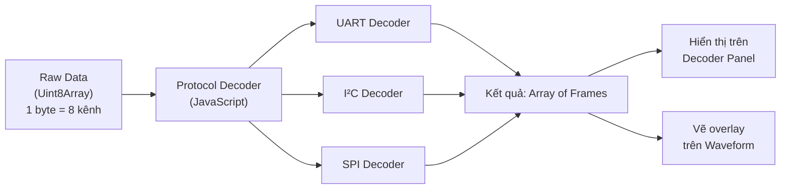

# 🔧 Kế Hoạch Triển Khai Protocol Decoder (UART / I²C / SPI)

## Tổng Quan Kiến Trúc



### Channel Mapping hiện tại

| Bit | Channel | Giao thức | Vai trò |
|-----|---------|-----------|---------|
| 0   | CH0     | UART      | TX      |
| 1   | CH1     | UART      | RX      |
| 2   | CH2     | I²C       | SCL     |
| 3   | CH3     | I²C       | SDA     |
| 4   | CH4     | SPI       | SCK     |
| 5   | CH5     | SPI       | MOSI    |
| 6   | CH6     | SPI       | MISO    |
| 7   | CH7     | SPI       | CS      |

### Cấu trúc dữ liệu chung cho tất cả decoder

```javascript
// Mỗi decoder trả về mảng frames kiểu này:
const frame = {
  type: 'uart' | 'i2c' | 'spi',
  startSample: 12345,    // vị trí bắt đầu (index trong data[])
  endSample: 12890,      // vị trí kết thúc
  label: 'UART',         // tên hiển thị
  data: [...],           // dữ liệu decode được (tùy giao thức)
  summary: '0x48 "H"',   // text ngắn hiển thị trên waveform
  color: '#3dc1d3',      // màu overlay
};
```

---

## 1️⃣ UART Decoder

> [!NOTE]
> Đã có bản cơ bản trong `renderUartFrames()` (dòng 1436). Cần nâng cấp thành module riêng, hỗ trợ cấu hình baud rate, và vẽ overlay.

### Nguyên lý UART

```
Idle (HIGH)
    │
    ▼ Start bit (LOW, 1 bit)
    ▼ Data bits (LSB first, 5-9 bits)
    ▼ Parity bit (optional)
    ▼ Stop bit(s) (HIGH, 1-2 bits)
    │
Idle (HIGH)
```

### Thuật toán

```javascript
function decodeUART(data, config) {
  // config = { chBit: 0, baud: 115200, dataBits: 8, parity: 'none', stopBits: 1 }
  const sr = state.capture.sampleRate;  // 20 MHz
  const bitSamples = Math.round(sr / config.baud);
  const mask = 1 << config.chBit;
  const frames = [];
  let i = 1;

  while (i < data.length) {
    const prev = (data[i - 1] & mask) !== 0;
    const curr = (data[i] & mask) !== 0;

    // Phát hiện Start bit: HIGH → LOW
    if (prev && !curr) {
      const startSample = i;
      let byte = 0;

      // Sample giữa mỗi bit (offset 1.5 bit từ cạnh xuống)
      for (let b = 0; b < config.dataBits; b++) {
        const samplePos = i + Math.floor(bitSamples * (1.5 + b));
        if (samplePos < data.length && (data[samplePos] & mask)) {
          byte |= (1 << b);
        }
      }

      // Kiểm tra stop bit
      const stopPos = i + Math.floor(bitSamples * (1.5 + config.dataBits));
      const validStop = stopPos < data.length && (data[stopPos] & mask);

      const endSample = i + bitSamples * (1 + config.dataBits + config.stopBits);
      const ascii = byte >= 32 && byte < 127 ? String.fromCharCode(byte) : '·';

      frames.push({
        type: 'uart',
        startSample,
        endSample,
        data: [byte],
        summary: `0x${byte.toString(16).padStart(2, '0').toUpperCase()} '${ascii}'`,
        valid: validStop,
        time: startSample / sr,
      });

      i = endSample;  // Nhảy qua frame đã decode
    } else {
      i++;
    }
  }
  return frames;
}
```

### Cấu hình UI cho UART

```
┌────────────────────────────┐
│ [UART]  CH0 → TX           │
│  Baud: [115200 ▼]          │
│  Bits: [8 ▼]  Parity: [N ▼]│
│  Stop: [1 ▼]               │
│─────────────────────────────│
│  0.200 ms  0x48  'H'       │
│  0.287 ms  0x65  'e'       │
│  0.374 ms  0x6C  'l'       │
│  ...                        │
└────────────────────────────┘
```

---

## 2️⃣ I²C Decoder

### Nguyên lý I²C

```
          START                 STOP
SDA: ──┐        ┌──────        ──┐  ┌──
       └────────┘ data           └──┘
SCL: ────┐  ┌──┐  ┌──          ──────
         └──┘  └──┘

START = SDA xuống trong khi SCL đang HIGH
STOP  = SDA lên trong khi SCL đang HIGH
Data  = đọc SDA khi SCL cạnh lên (rising edge)
```

### Thuật toán

```javascript
function decodeI2C(data, config) {
  // config = { sclBit: 2, sdaBit: 3 }
  const sr = state.capture.sampleRate;
  const sclMask = 1 << config.sclBit;
  const sdaMask = 1 << config.sdaBit;
  const frames = [];
  let inTransaction = false;
  let currentBits = [];
  let currentBytes = [];
  let bitCount = 0;
  let startSample = 0;
  let byteStartSample = 0;

  for (let i = 1; i < data.length; i++) {
    const prevSCL = (data[i - 1] & sclMask) !== 0;
    const currSCL = (data[i] & sclMask) !== 0;
    const prevSDA = (data[i - 1] & sdaMask) !== 0;
    const currSDA = (data[i] & sdaMask) !== 0;

    // ===== Phát hiện START condition =====
    // SDA xuống (1→0) trong khi SCL = HIGH
    if (prevSDA && !currSDA && currSCL) {
      inTransaction = true;
      startSample = i;
      currentBits = [];
      currentBytes = [];
      bitCount = 0;

      frames.push({
        type: 'i2c', startSample: i, endSample: i,
        summary: 'START', data: [], eventType: 'start',
        time: i / sr,
      });
      continue;
    }

    // ===== Phát hiện STOP condition =====
    // SDA lên (0→1) trong khi SCL = HIGH
    if (!prevSDA && currSDA && currSCL && inTransaction) {
      frames.push({
        type: 'i2c', startSample: i, endSample: i,
        summary: 'STOP', data: currentBytes, eventType: 'stop',
        time: i / sr,
      });
      inTransaction = false;
      continue;
    }

    // ===== Đọc data bit trên SCL rising edge =====
    if (!prevSCL && currSCL && inTransaction) {
      if (bitCount === 0) byteStartSample = i;

      currentBits.push(currSDA ? 1 : 0);
      bitCount++;

      // Sau 8 bit data + 1 bit ACK = 9 clock cycles
      if (bitCount === 9) {
        // 8 bit đầu = data (MSB first)
        let byte = 0;
        for (let b = 0; b < 8; b++) {
          byte = (byte << 1) | currentBits[b];
        }
        const ack = !currentBits[8]; // ACK = SDA LOW

        // Byte đầu tiên = address
        const isAddr = currentBytes.length === 0;
        let summary;
        if (isAddr) {
          const addr = byte >> 1;
          const rw = (byte & 1) ? 'R' : 'W';
          summary = `0x${addr.toString(16).padStart(2, '0').toUpperCase()} ${rw} ${ack ? 'ACK' : 'NAK'}`;
        } else {
          summary = `0x${byte.toString(16).padStart(2, '0').toUpperCase()} ${ack ? 'ACK' : 'NAK'}`;
        }

        currentBytes.push({ byte, ack, isAddr });
        frames.push({
          type: 'i2c',
          startSample: byteStartSample,
          endSample: i,
          summary,
          data: [byte],
          eventType: isAddr ? 'address' : 'data',
          time: byteStartSample / sr,
        });

        currentBits = [];
        bitCount = 0;
      }
    }
  }
  return frames;
}
```

### Kết quả hiển thị I²C

```
┌────────────────────────────┐
│ [I²C]  SCL=CH2, SDA=CH3    │
│─────────────────────────────│
│  0.142 ms  START            │
│  0.156 ms  0x68 W   ACK    │
│  0.184 ms  0x3B      ACK   │
│  0.213 ms  0x42      ACK   │
│  0.241 ms  STOP             │
└────────────────────────────┘
```

---

## 3️⃣ SPI Decoder

### Nguyên lý SPI

```
CS:   ──┐                          ┌──
        └──────────────────────────┘
SCK:  ───┐ ┌─┐ ┌─┐ ┌─┐ ┌─┐ ┌─┐ ┌─┐ ┌───
         └─┘ └─┘ └─┘ └─┘ └─┘ └─┘ └─┘
MOSI: ──X───X───X───X───X───X───X───X──
MISO: ──X───X───X───X───X───X───X───X──

- CS LOW  = bắt đầu transaction
- Đọc MOSI/MISO trên cạnh lên (hoặc xuống) của SCK
- MSB first (thông thường)
- Mỗi 8 clock = 1 byte
```

### Thuật toán

```javascript
function decodeSPI(data, config) {
  // config = { sckBit: 4, mosiBit: 5, misoBit: 6, csBit: 7,
  //            cpol: 0, cpha: 0, csActive: 'low', bitOrder: 'msb' }
  const sr = state.capture.sampleRate;
  const sckMask  = 1 << config.sckBit;
  const mosiMask = 1 << config.mosiBit;
  const misoMask = 1 << config.misoBit;
  const csMask   = 1 << config.csBit;
  const frames = [];

  // Xác định CS active
  const csActive = (val) => config.csActive === 'low' ? !(val & csMask) : !!(val & csMask);

  // Xác định sampling edge dựa trên CPOL/CPHA
  // CPOL=0, CPHA=0 → sample trên rising edge (mặc định)
  // CPOL=0, CPHA=1 → sample trên falling edge
  // CPOL=1, CPHA=0 → sample trên falling edge
  // CPOL=1, CPHA=1 → sample trên rising edge
  const sampleOnRising = (config.cpol === 0 && config.cpha === 0) ||
                         (config.cpol === 1 && config.cpha === 1);

  let inTransaction = false;
  let mosiBits = [], misoBits = [];
  let byteStartSample = 0;
  let transactionStart = 0;

  for (let i = 1; i < data.length; i++) {
    const prevCS = csActive(data[i - 1]);
    const currCS = csActive(data[i]);

    // CS bắt đầu (inactive → active)
    if (!prevCS && currCS) {
      inTransaction = true;
      transactionStart = i;
      mosiBits = [];
      misoBits = [];
    }

    // CS kết thúc (active → inactive)
    if (prevCS && !currCS && inTransaction) {
      inTransaction = false;
      continue;
    }

    if (!inTransaction) continue;

    // Phát hiện clock edge
    const prevSCK = (data[i - 1] & sckMask) !== 0;
    const currSCK = (data[i] & sckMask) !== 0;

    const isRisingEdge  = !prevSCK && currSCK;
    const isFallingEdge = prevSCK && !currSCK;
    const isSampleEdge  = sampleOnRising ? isRisingEdge : isFallingEdge;

    if (isSampleEdge) {
      if (mosiBits.length === 0) byteStartSample = i;

      // Đọc MOSI và MISO
      const mosiBit = (data[i] & mosiMask) ? 1 : 0;
      const misoBit = (data[i] & misoMask) ? 1 : 0;
      mosiBits.push(mosiBit);
      misoBits.push(misoBit);

      // Đủ 8 bit → tạo frame
      if (mosiBits.length === 8) {
        let mosiByte = 0, misoByte = 0;

        if (config.bitOrder === 'msb') {
          for (let b = 0; b < 8; b++) {
            mosiByte = (mosiByte << 1) | mosiBits[b];
            misoByte = (misoByte << 1) | misoBits[b];
          }
        } else {
          for (let b = 0; b < 8; b++) {
            mosiByte |= mosiBits[b] << b;
            misoByte |= misoBits[b] << b;
          }
        }

        const mosiHex = mosiByte.toString(16).padStart(2, '0').toUpperCase();
        const misoHex = misoByte.toString(16).padStart(2, '0').toUpperCase();

        frames.push({
          type: 'spi',
          startSample: byteStartSample,
          endSample: i,
          summary: `TX:0x${mosiHex} RX:0x${misoHex}`,
          data: { mosi: mosiByte, miso: misoByte },
          time: byteStartSample / sr,
        });

        mosiBits = [];
        misoBits = [];
      }
    }
  }
  return frames;
}
```

### Cấu hình SPI

```
┌─────────────────────────────────┐
│ [SPI]  SCK=CH4 MOSI=CH5        │
│        MISO=CH6 CS=CH7         │
│  CPOL: [0 ▼]  CPHA: [0 ▼]     │
│  Bit order: [MSB first ▼]      │
│─────────────────────────────────│
│  5.100 ms  TX:0xA5  RX:0x5A    │
│  5.125 ms  TX:0x5A  RX:0xA5    │
│  5.150 ms  TX:0xFF  RX:0x00    │
│  ...                            │
└─────────────────────────────────┘
```

---

## 📋 Tích Hợp Vào UI

### Bước 1: Tạo Decoder Manager

```javascript
// Quản lý tất cả decoder, lưu cấu hình + kết quả
const decoders = {
  uart: {
    enabled: true,
    config: { chBit: 0, baud: 115200, dataBits: 8, parity: 'none', stopBits: 1 },
    frames: [],
  },
  i2c: {
    enabled: true,
    config: { sclBit: 2, sdaBit: 3 },
    frames: [],
  },
  spi: {
    enabled: false,  // tắt mặc định, bật khi cần
    config: { sckBit: 4, mosiBit: 5, misoBit: 6, csBit: 7,
              cpol: 0, cpha: 0, csActive: 'low', bitOrder: 'msb' },
    frames: [],
  },
};

function runAllDecoders() {
  if (decoders.uart.enabled)
    decoders.uart.frames = decodeUART(state.data, decoders.uart.config);
  if (decoders.i2c.enabled)
    decoders.i2c.frames = decodeI2C(state.data, decoders.i2c.config);
  if (decoders.spi.enabled)
    decoders.spi.frames = decodeSPI(state.data, decoders.spi.config);
}
```

### Bước 2: Vẽ Overlay trên Waveform

Trong hàm `drawWaves()`, sau khi vẽ sóng xong, vẽ thêm các "annotation box" trên kênh tương ứng:

```javascript
function drawDecoderOverlays() {
  Object.values(decoders).forEach(dec => {
    if (!dec.enabled) return;
    dec.frames.forEach(frame => {
      // Tính vị trí pixel từ sample index
      const x1 = sampleToPixel(frame.startSample);
      const x2 = sampleToPixel(frame.endSample);
      // Vẽ hộp nhỏ + text summary
      drawAnnotationBox(x1, x2, channelY, frame.summary, frame.color);
    });
  });
}
```

### Bước 3: Cập nhật Decoder Panel

Thay thế nội dung cứng hiện tại bằng nội dung generate từ `decoders.xxx.frames`.

---

## 🗓 Thứ Tự Triển Khai Đề Xuất

```mermaid
gantt
    title Lộ trình triển khai Decoder
    dateFormat X
    axisFormat %s

    section Phase 1
    Decoder Manager + data structure    :a1, 0, 1
    UART decoder (nâng cấp)             :a2, 1, 2

    section Phase 2
    I²C decoder                         :b1, 2, 4
    SPI decoder                         :b2, 2, 4

    section Phase 3
    Waveform overlay annotation         :c1, 4, 5
    Cấu hình UI (baud, CPOL...)         :c2, 5, 6
    Test với dữ liệu thật từ Pico      :c3, 6, 7
```



| Phase | Công việc | Độ khó |
|-------|-----------|--------|
| **1** | Tạo Decoder Manager + nâng cấp UART | ⭐ Dễ |
| **2** | Viết I²C decoder + SPI decoder | ⭐⭐ Trung bình |
| **3** | Vẽ overlay + UI cấu hình + test thật | ⭐⭐⭐ Khó nhất |

> [!IMPORTANT]
> **Phase 1 nên làm trước** vì UART đã có sẵn code, chỉ cần refactor. Sau đó I²C và SPI có thể chia cho 2 người làm song song.

---

## 👥 Gợi Ý Phân Công (4 người)

| Người | Phần việc |
|-------|-----------|
| **A** | UART decoder + Decoder Manager (khung chung) |
| **B** | I²C decoder |
| **C** | SPI decoder |
| **D** | Waveform overlay + UI cấu hình |

> [!TIP]
> Người **A** nên làm xong Decoder Manager trước (cấu trúc `decoders`, hàm `runAllDecoders()`, hàm render panel) → rồi B, C, D mới plug code vào.
